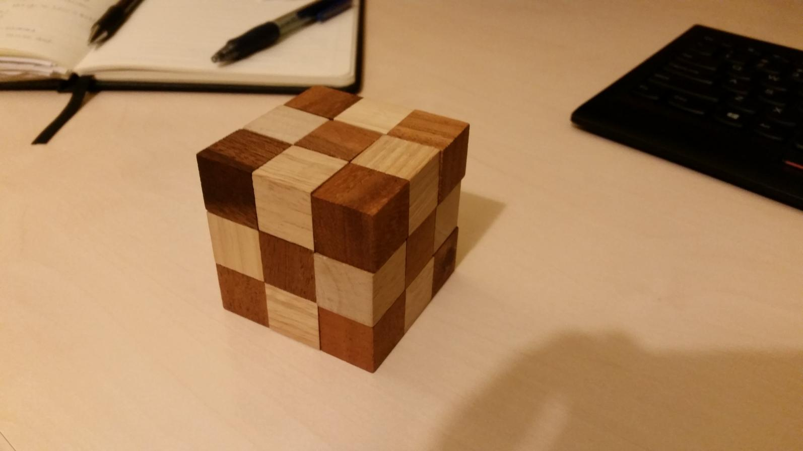

# Snakecube

## About

A small python program implementing a backtracking (aka bruteforce) algorithm for solving snake cubes (in three dimensions). Theoretically arbitrary cube sizes are supported, but everything is hardcoded right now.

I started this project to get familiar with Python. Since it is my first Python project, expect many very rough edges. ;) FWIW I tried to focus more on "code readability" and simplicity instead of efficiency. I also wrote some docstrings (using the google style docstring format), just to try it out.

A snake cube is a 3D wooden puzzle. Some pictures:

- [Assembled snake cube](./images/snakecube0.jpg)
- [Partly assembled snake cube](./images/snakecube1.jpg)
- [Unassembled snake cube](./images/snakecube2.jpg)

The example snake cube used in this program can be found here: <https://knobelholz.de/index.php/de/knobelshop/holz-puzzle-3d-de/snake-cube-braun-medium-holzpuzzle-detail>

Some random video (that I didn't watch) showing how a snake cube is solved: [How to Solve Snake Cube Puzzle - YouTube](https://www.youtube.com/watch?v=htqNnT4qSEc)

## Running the script

Just run `python snakecube.py`. It will print out the solutions for the chain hardcoded in the main function, together with a note that the two solutions found are similar.

Example output can be found [here](./snakecube.example_output).

## Implementation

Some notes/thoughts on my implementation.

### Nomenclature

- **Chain** = the whole thing.
- **Element** = one of the small mini-cubes. There are three kinds of elements:
  - Single-joint elements (first and last element in the chain).
  - 180 degree dual-joint elements (joints on opposite sides).
  - 90 degree dual-joint elements (joints on adjacent sides; the most interesting variant).
- **Slice** = a 1-dimensional sequence of elements "of maximum length", i.e. no other element can be added to the slice without "opening" another dimension.
  - Sart/end points of a slice are either single-joint elements or 90 degree dual-joint elements, with zero or more 180 degree dual-joint elements in between.
  - Every element is part of either one slice or of two slices.

## Notes

Goal: Find all possible foldings of the chain which lead to a (collision-free, non-shallow) 3x3x3 cube.

Use a right-handed cartesian coordinate system using only positive coordinates, and place the cube in the first quadrant with one corner element being in the origin:

          4
         / z
        /
       +-----------+
      /           /|
     /           / |
    +---+---+---+-------->
    |   |   |   |  |   x
    +---+---+---+  |
    |   |   |   |  +
    +---+---+---+ /
    |   |   |   |/
    +---+---+---+
    |
    |
    | y
    v

Note: In the first quadrant, where all coordinates are positive, every point of an NxNxN cube can be assigned a unique integer easily via `P(x,y,z) = x + N*y + N*N*z`.

Because each joint in the chain can spin 360 deg, only the following starting points and directions need to be considered:

    P(0,0,0) with directions: x
    P(1,0,0) with directions: x, y
    P(1,1,0) with directions: x, z
    P(1,1,1) with directions: x

For rotation matrices, see <https://en.wikipedia.org/wiki/Rotation_matrix#Basic_rotations>.

Given a chain composed of `m` elements and `n` slices, a solution can be represented unambiguously in one of the following ways:

1. A sequence of `m` coordinates, where the `i`th coordinate marks the position of the `i`th element in the chain.
2. The coordinates of a starting point together with a sequence of `n` base vectors, where each base vector marks the relative direction of the subsequent 90 degree dual-joint element (or of the last element) in the chain as seen from the previous element.
3. A sequence of `n + 1` coordinates, where each coordinate marks the position of either a 90 degree dual-joint element, or a single-joint element (start/end).

The backtracking does only need to be solved for one chain direction, not for both (it would duplicate all solutions).

[Crappy sketch of a 2D variant](./images/2d_sketch_dev.jpg) used during development.

## TODO / ideas

### General

- Make the code more "pythonic", I guess.
- Use more exceptions, e.g. when checking for joint state overflows: `[(joint_state+1)%4]`
- Implement conversion functions for different chain representations.
- Document algorithm in this README.

### Possible performance improvements

- `self._nsteps()` sometimes calculates more cycles than needed. Pass the desired number of steps as argument to it?
- Iterating over offset in `_cube_set_offset()` like it is done in `_backtrack()` is very inefficient (`O(n*n)` instead of `O(n)`), c.f. implementation of `_cube_set_offset()`.
- Use `map()` instead of `[n for n in ...]`: <https://docs.python.org/3/library/timeit.html#basic-examples>
- `jointDirections` should probably be an array... with constants as "lookup keys"?
- Create `reset()` in class `Backtrack` to reuse a completed instance.

### Future projects

- Create a 2D variant.
- Create a 4D variant?
- Recursive implementation.
- What mathematical objects/concepts can be used for modelling and solving the snake cube? `(Z/3Z)^3`?

